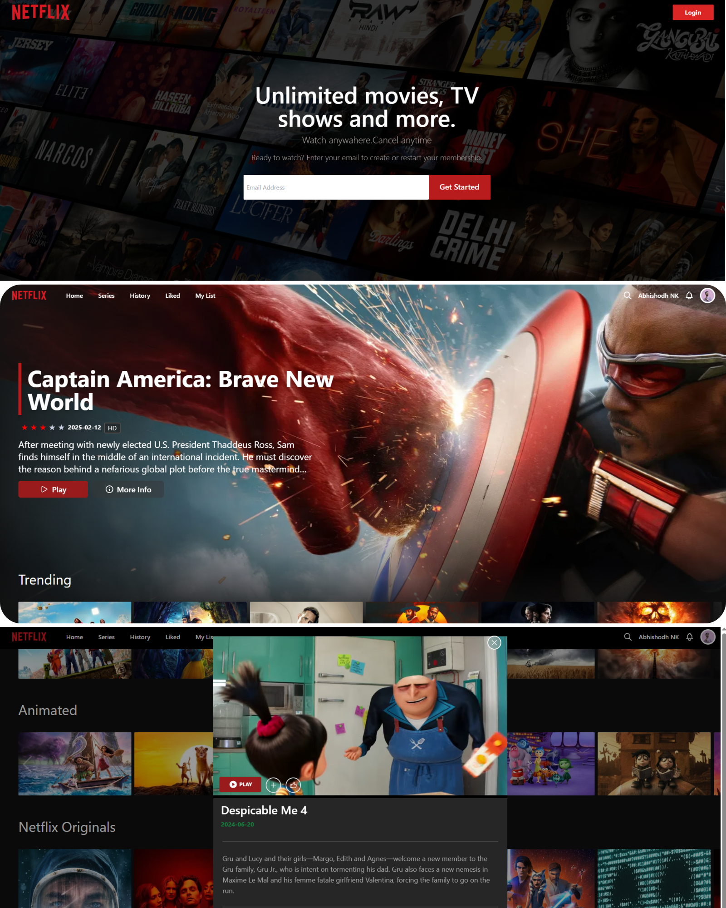

# Netflix Clone React.js

Netflix clone project was developed to strengthen proficiency in React.js and modern web development practices. Featuring a fully interactive user interface, it delivers an immersive streaming experience powered by the TMDB API for dynamic movie listings and Firebase for backend services including user authentication and data management. The project showcases a blend of popular technologies and adheres to best coding practices, making it a comprehensive demonstration of full-stack development skills.

## Screenshots

### mobile experience 

 
## Key Functionalities
- Sign In / Sign Up
- Home Page for browsing movies
- My List Section for user-specific movie selections
- Liked Movies Page
- Watched Movies Page
- Profile Page
- Play Movie Page
- Search Movie Page

## Technologies Used
- [React.js](https://react.dev/)
- [TMDB API](https://www.themoviedb.org/)
- [Firebase](https://firebase.google.com/)
- [Axios](https://www.npmjs.com/package/axios)
- [React-Youtube](https://www.npmjs.com/package/react-youtube)
- [Tailwind CSS](https://tailwindcss.com/)

